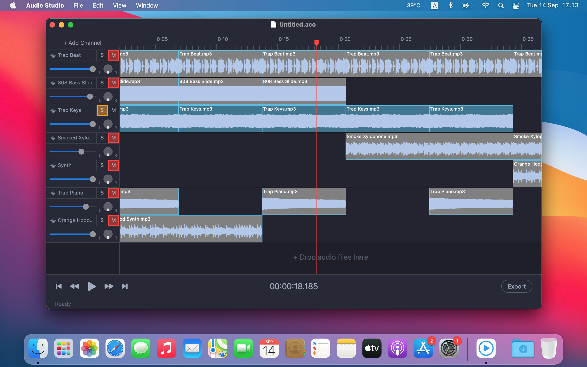

# Audio Studio

Simple digital audio workstation for macOS.
Will be available on AppStore soon.

## Installing

Download and run the `AudioStudio.zip` file for the latest [release](https://github.com/russelldzhafarov/audio-composition-macos/releases).

## Author

Ruslan Dzhafarov

## Contacts

Do you have any questions, feedback or good ideas? I'm always happy to hear from you! Please contact me at russell.dzhafarov@gmail.com.

## License

You are permitted to use this
source code, with or without modification, in source or binary form, on
your devices however you see fit.  You are not permitted to redistribute
binaries of this source code, with or without modification.  In other
words, you cannot put this application or any application derived from
it, on the Apple App Store, Cydia, or any other binary-only distribution
channel.
